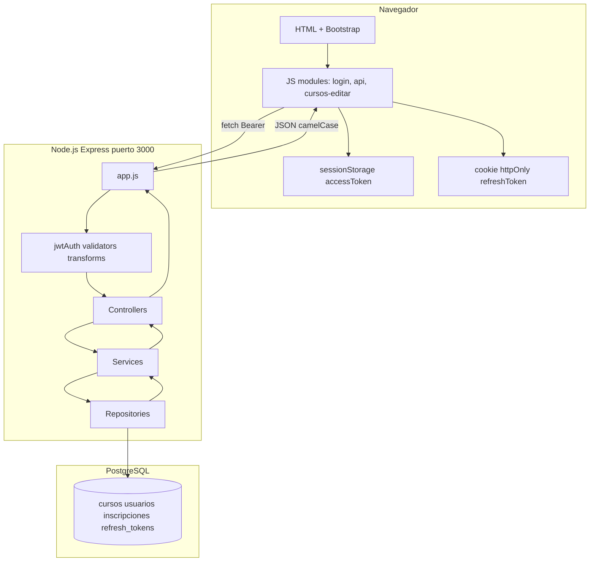

# Guía de tecnologías del TFI

Este documento explica **qué es cada tecnología** usada en el integrador, **para qué sirve en este proyecto** y **dónde encontrarla en el código**.

---

## Vista general del stack

---

## Backend e infraestructura

### Node.js (≥ 18) + ESM

**Qué es:** Entorno de ejecución de JavaScript fuera del navegador. ESM (ECMAScript Modules) permite usar `import`/`export` nativos en lugar de `require`.

**Rol en el TFI:** Ejecuta el servidor API. Todo el backend usa módulos ES (`"type": "module"` en `package.json`).

**Archivos clave:**
- `Proyecto/api/package.json`
- Cualquier `.js` del backend con `import ... from '...'`

---

### Express 4

**Qué es:** Framework minimalista para crear servidores HTTP y APIs REST en Node.js.

**Rol en el TFI:**
- Recibe peticiones HTTP (GET, POST, PUT, DELETE)
- Monta rutas bajo `/api/v2/*`
- Sirve archivos estáticos del front desde `Proyecto/web/`
- Aplica middlewares (seguridad, parsing JSON, autenticación)

**Archivos clave:**
- `Proyecto/api/app.js` — configuración principal de Express
- `Proyecto/api/bin/www` — punto de entrada (`npm start` → `node ./bin/www`)
- `Proyecto/api/routes/*.routes.js` — definición de endpoints

---

### PostgreSQL + driver `pg`

**Qué es:** Base de datos relacional. El paquete `pg` es el driver oficial de Node.js para conectarse a PostgreSQL.

**Rol en el TFI:** Persiste usuarios, cursos, estudiantes, inscripciones y refresh tokens. Todas las consultas son SQL parametrizado (protección contra inyección SQL).

**Archivos clave:**
- `Proyecto/api/db/pool.js` — pool de conexiones único compartido
- `Proyecto/api/repositories/*.repository.js` — consultas SQL por recurso
- `dump base programacion.sql` — esquema y datos de prueba
- `Proyecto/api/migrations/` — cambios incrementales (ej. tabla `refresh_tokens`)

**Variables de entorno:** `DB_HOST`, `DB_PORT`, `DB_USER`, `DB_PASSWORD`, `DB_NAME` (ver `.env.example`).

---

### JWT (`jsonwebtoken`)

**Qué es:** JSON Web Token. Estándar para transmitir información firmada entre cliente y servidor. En este proyecto se usan **dos tokens**:

| Token | Duración | Dónde vive | Para qué |
|-------|----------|------------|----------|
| Access token | ~15 minutos | `sessionStorage` del navegador | Autorizar cada request (`Authorization: Bearer ...`) |
| Refresh token | ~7 días | Cookie httpOnly | Renovar el access token sin volver a loguearse |

**Rol en el TFI:** Autenticación stateless en la API. El middleware `jwtAuth` verifica el access token y revalida que el usuario siga activo en BD.

**Archivos clave:**
- `Proyecto/api/services/auth.service.js` — login, emisión y rotación de tokens
- `Proyecto/api/middleware/jwtAuth.js` — verificación del Bearer token
- `Proyecto/web/js/auth.js` — guardar/leer access token en sessionStorage
- `Proyecto/web/js/api.js` — renovación automática ante 401

**Variables:** `JWT_SECRET`, `JWT_REFRESH_SECRET`, `JWT_ACCESS_EXPIRES_IN`, `JWT_REFRESH_EXPIRES_IN`.

---

### Cookies httpOnly

**Qué es:** Mecanismo del navegador para guardar datos en el cliente. `httpOnly` significa que JavaScript **no puede leer** la cookie (protege el refresh token de XSS).

**Rol en el TFI:** El refresh token se envía y recibe solo por cookie, con `credentials: 'include'` en `fetch`.

**Archivos clave:**
- `Proyecto/api/utils/authCookies.js` — set/clear de la cookie `refreshToken`
- `Proyecto/api/controllers/auth.controller.js` — login y logout setean/limpian la cookie

---

### `express-validator`

**Qué es:** Librería para validar y sanitizar datos de entrada HTTP (body, params, query).

**Rol en el TFI:** Cada recurso tiene validators que rechazan requests mal formados **antes** de llegar al controller (respuesta 400 con `{ errors: [...] }`).

**Archivos clave:**
- `Proyecto/api/validators/cursosBody.validation.js` — campos obligatorios al crear/editar curso
- `Proyecto/api/validators/cursosIdParam.validation.js` — `:id` numérico en la URL
- `Proyecto/api/middleware/handleValidationErrors.js` — convierte errores de validación en respuesta HTTP

---

### Seguridad: `helmet`, `cors`, rate limit

| Paquete | Qué hace | Dónde |
|---------|----------|-------|
| `helmet` | Headers HTTP de seguridad (XSS, clickjacking, etc.) | `app.js` |
| `cors` | Controla qué origen del front puede llamar a la API | `app.js` (`FRONT_ORIGIN`) |
| `express-rate-limit` | Limita intentos de login (5 por IP cada 15 min) | `middleware/loginRateLimit.js` |

---

### Swagger (`swagger-jsdoc` + `swagger-ui-express`)

**Qué es:** Documentación interactiva de la API. Permite probar endpoints desde el navegador.

**Rol en el TFI:** Disponible en `http://localhost:3000/docs`. Los comentarios `@openapi` en los archivos de rutas generan la spec.

**Archivo clave:** `Proyecto/api/app.js` (montaje de `/docs`).

---

### `dotenv`

**Qué es:** Carga variables de entorno desde un archivo `.env` al arrancar Node.

**Rol en el TFI:** Secretos JWT, conexión a BD, puerto, CORS. El `.env` no se commitea (está en `.gitignore`).

**Archivo clave:** `Proyecto/api/.env.example` (plantilla).

---

### `pdfkit`

**Qué es:** Librería para generar documentos PDF en Node.js.

**Rol en el TFI:** Genera certificados PDF de inscripciones (`GET /api/v2/inscripciones/:id/certificado`).

**Archivo clave:** servicio de inscripciones en `Proyecto/api/services/inscripciones.service.js`.

---

### Otros paquetes útiles

| Paquete | Rol breve |
|---------|-----------|
| `morgan` | Log de requests HTTP en consola (`dev`) |
| `cookie-parser` | Parseo de cookies entrantes |
| `http-errors` | Errores HTTP tipados (404, 409, 422) en services |
| `debug` | Logging de arranque del servidor en `bin/www` |

---

## Frontend

### HTML / CSS / JavaScript vanilla

**Qué es:** Tecnologías web estándar sin framework SPA (sin React, Angular ni Vue).

**Rol en el TFI:** Una página HTML por pantalla (`login.html`, `cursos.html`, `cursos-editar.html`, etc.) con un script JS dedicado por funcionalidad.

**Archivos clave:**
- `Proyecto/web/*.html` — pantallas
- `Proyecto/web/js/*.js` — lógica por página
- `Proyecto/web/css/estilo.css` — estilos propios

---

### Bootstrap 5.3.3 (local)

**Qué es:** Framework CSS/JS para layout, formularios, modales, navbar.

**Rol en el TFI:** UI consistente sin escribir todo el CSS desde cero. Archivos incluidos localmente (no CDN).

**Archivos clave:**
- `Proyecto/web/css/bootstrap.min.css`
- `Proyecto/web/js/bootstrap.bundle.min.js`

---

### Módulos ES en el front (`import` / `export`)

**Qué es:** Misma sintaxis de módulos que el backend, soportada nativamente por navegadores modernos vía `<script type="module">`.

**Rol en el TFI:** Separación de responsabilidades:
- `config.js` — URL base de la API
- `auth.js` — token en sessionStorage
- `api.js` — wrapper de `fetch` con JWT y auto-refresh
- `requireAuth.js` — guard para páginas protegidas
- `login.js`, `cursos-editar.js`, etc. — lógica de cada pantalla

---

### `fetch` + `api.js`

**Qué es:** API nativa del navegador para HTTP. `api.js` centraliza todas las llamadas a la API.

**Rol en el TFI:**
- Añade header `Authorization: Bearer <token>`
- Envía `credentials: 'include'` para la cookie de refresh
- Si recibe 401, intenta `POST /api/v2/auth/refresh` y reintenta la petición original
- Si el refresh falla, redirige a login

**Archivo clave:** `Proyecto/web/js/api.js`

---

### `sessionStorage`

**Qué es:** Almacenamiento del navegador por pestaña. Se borra al cerrar la pestaña.

**Rol en el TFI:** Guarda el **access token** JWT y el nombre de usuario para mostrar en la navbar. No guarda el refresh token (va en cookie httpOnly).

**Archivo clave:** `Proyecto/web/js/auth.js`

---

## Tabla resumen rápida

| Capa | Tecnologías principales |
|------|-------------------------|
| Navegador | HTML, Bootstrap 5, JS modules, fetch, sessionStorage, cookies |
| Servidor | Node.js, Express, middlewares, capas (routes → … → repository) |
| Datos | PostgreSQL, pool `pg`, SQL parametrizado |
| Auth | JWT access + refresh, SHA-256 para contraseñas, rate limit en login |
| Docs API | Swagger en `/docs` |

---

## Siguiente paso

Para entender **cómo se organiza el código en capas**, continuá con [02-arquitectura-capas.md](./02-arquitectura-capas.md).
