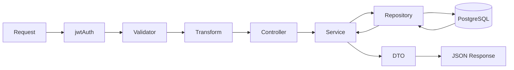

# Arquitectura en capas

Este documento explica **cómo está organizado el backend** del integrador: el patrón en capas, las convenciones de nombres y qué hace cada middleware.

---

## Flujo de una petición API v2

Toda operación de negocio sigue el mismo recorrido:

```text
Request HTTP
  → Middleware global (jwtAuth, salvo auth pública)
  → Validator (express-validator)
  → Transform (filtros, paginación, orden — si aplica)
  → Controller (solo HTTP: req/res)
  → Service (reglas de negocio)
  → Repository (SQL parametrizado)
  → PostgreSQL
  → DTO (snake_case → camelCase)
  → Response JSON
```

Diagrama:



---

## Responsabilidad de cada capa

### 1. Routes (`routes/*.routes.js`)

**Qué hace:** Define URLs, métodos HTTP y encadena middlewares + controller.

**Qué NO hace:** Lógica de negocio ni SQL.

**Ejemplo — edición de curso:**

```javascript
// Proyecto/api/routes/cursos.routes.js
router.put('/:id(\\d+)', [cursosIdParamValidation, cursosBodyValidation], asyncHandler(cursosController.edit));
```

Montaje en `app.js`:

```javascript
app.use('/api/v2/cursos', asyncHandler(jwtAuth), cursosRouter);
```

Todas las rutas de cursos pasan por `jwtAuth` **antes** del router.

---

### 2. Validators (`validators/*.validation.js`)

**Qué hace:** Valida formato y tipos de entrada (body, params, query). Rechaza datos inválidos con HTTP 400.

**Ejemplo:** `cursosBody.validation.js` exige `nombre`, `descripcion`, `fechaInicio`, `cantidadHoras`, `inscriptosMax`, `idCursoEstado` con tipos y rangos correctos.

**Qué NO hace:** Reglas de negocio (ej. “cupo no puede ser menor que inscriptos actuales”). Eso va en el Service.

---

### 3. Transforms (`transforms/*.transform.js`)

**Qué hace:** Normaliza query params en propiedades de `req` (`filter`, `limit`, `offset`, `order`) para listados paginados.

**Ejemplo:** `GET /api/v2/cursos?nombre=prog&limit=10&offset=0` → el transform arma el objeto de filtro para el service.

**En edición de curso (PUT):** no se usa transform; solo validators.

---

### 4. Controllers (`controllers/*.controller.js`)

**Qué hace:** Capa fina HTTP. Extrae datos de `req`, llama al service, devuelve status y JSON.

**Qué NO hace:** Validaciones de negocio ni acceso directo a BD.

**Ejemplo — editar curso:**

```javascript
// Proyecto/api/controllers/cursos.controller.js
edit = async (req, res) => {
  const curso = await this.service.update(req.params.id, req.body, req.user.id_usuario);
  res.json(curso);
};
```

`req.user` lo inyecta `jwtAuth` con el usuario autenticado.

---

### 5. Services (`services/*.service.js`)

**Qué hace:** **Reglas de negocio** y orquestación. Traduce nombres camelCase (API) a snake_case (BD). Lanza errores HTTP semánticos (`404`, `409`, `422`).

**Ejemplo — reglas al editar curso** (`cursos.service.js`):

1. El estado (`idCursoEstado`) debe existir y estar activo en `cursos_estados`
2. `inscriptosMax` no puede ser menor que la cantidad de inscriptos activos (409 Conflict)
3. Si el UPDATE no afecta filas → 404
4. Tras actualizar, devuelve el curso completo vía `getById`

**BaseService:** clase padre con utilidades para mapear claves (`KEYS_MAP`).

---

### 6. Repositories (`repositories/*.repository.js`)

**Qué hace:** **Único lugar con SQL**. Usa el pool de `db/pool.js`. Consultas parametrizadas (`$1`, `$2`, …).

**Qué NO hace:** Decidir si una operación es válida a nivel negocio.

**Ejemplo — UPDATE de curso:**

```sql
UPDATE cursos
   SET nombre = $1, descripcion = $2, fecha_inicio = $3,
       cantidad_horas = $4, inscriptos_max = $5, id_curso_estado = $6,
       id_usuario_modificacion = $7, fecha_hora_modificacion = NOW()
 WHERE id_curso = $8
```

---

### 7. DTOs (`dtos/*.response.dto.js`)

**Qué hace:** Transforma filas de BD (`snake_case`) a JSON de API (`camelCase`).

**Ejemplo — `CursoResponseDTO`:**

| Columna BD | Campo JSON |
|------------|------------|
| `id_curso` | `idCurso` |
| `fecha_inicio` | `fechaInicio` |
| `cantidad_horas` | `cantidadHoras` |
| `inscriptos_max` | `inscriptosMax` |
| `id_curso_estado` | `idCursoEstado` |

También calcula campos derivados: `inscriptosActuales`, `plazasDisponibles`.

---

## Convención de nombres

| Contexto | Convención | Ejemplo |
|----------|------------|---------|
| JSON API (request/response) | camelCase | `fechaInicio`, `inscriptosMax` |
| Columnas PostgreSQL | snake_case | `fecha_inicio`, `inscriptos_max` |
| Prefijo rutas | `/api/v2/` | `/api/v2/cursos/5` |

El **Service** traduce entre ambos al preparar datos para el Repository. El **DTO** traduce al responder.

---

## Middlewares

### Globales (en `app.js`)

| Middleware | Función |
|------------|---------|
| `cors` | Permite requests del front (`FRONT_ORIGIN`) con cookies |
| `helmet` | Headers de seguridad |
| `morgan('dev')` | Log de requests |
| `express.json()` | Parsea body JSON |
| `cookie-parser` | Lee cookies (refresh token) |
| `express.static(webRoot)` | Sirve HTML/CSS/JS del front |

### Por prefijo de ruta

| Prefijo | Middleware extra |
|---------|------------------|
| `/api/v2/auth` | Sin JWT en login/refresh/logout; `/me` sí requiere JWT |
| `/api/v2/cursos` | `jwtAuth` en todas las rutas |
| `/api/v2/estudiantes` | `jwtAuth` |
| `/api/v2/inscripciones` | `jwtAuth` |
| `/api/v2/dashboard` | `jwtAuth` |

### `jwtAuth` (detalle)

1. Lee `Authorization: Bearer <token>`
2. Verifica firma y expiración con `JWT_SECRET`
3. Consulta BD: usuario existe y `activo = 1`
4. Setea `req.user` con `id_usuario`, `nombre_usuario`, etc.

Si falla → **401** con `{ error: "..." }`.

### Otros middlewares

| Archivo | Uso |
|---------|-----|
| `asyncHandler.js` | Captura errores async y los pasa al error handler |
| `errorHandlers.js` | 404 y errores globales |
| `handleValidationErrors.js` | Respuesta 400 por validación |
| `loginRateLimit.js` | Rate limit solo en `POST /auth/login` |

---

## Esquema de base de datos (tablas relevantes)

### `usuarios`

Login del sistema.

| Columna | Descripción |
|---------|-------------|
| `id_usuario` | PK |
| `nombre_usuario` | Login (único) |
| `contrasenia` | Hash SHA-256 |
| `activo` | 1 = puede autenticarse |

### `cursos`

Datos del curso + auditoría.

| Columna | Descripción |
|---------|-------------|
| `id_curso` | PK |
| `nombre`, `descripcion`, `fecha_inicio`, `cantidad_horas`, `inscriptos_max` | Datos editables |
| `id_curso_estado` | FK → `cursos_estados` |
| `id_usuario_modificacion` | Quién modificó (del JWT) |
| `fecha_hora_modificacion` | Cuándo (NOW() en UPDATE) |

### `cursos_estados`

| id | descripcion | es_activo |
|----|-------------|-----------|
| 1 | BORRADOR | 1 |
| 2 | INSCRIPCIÓN ABIERTA | 1 |
| 3 | INSCRIPCIÓN CERRADA | 1 |
| 4 | ELIMINADO | 0 |

Los listados ocultan cursos cuyo estado tiene `es_activo = 0`. El DELETE lógico pone estado 4.

### `refresh_tokens` (migración 001)

Sesiones persistentes para el refresh token JWT.

| Columna | Descripción |
|---------|-------------|
| `jti` | ID único del token (UUID) |
| `id_usuario` | FK usuarios |
| `expires_at`, `revoked_at` | Control de rotación y revocación |

---

## Archivos por capa — flujo de edición de curso

| Capa | Archivo | Función principal |
|------|---------|-------------------|
| Front HTML | `Proyecto/web/cursos-editar.html` | Formulario de edición |
| Front JS | `Proyecto/web/js/cursos-editar.js` | Carga curso, submit PUT |
| Cliente HTTP | `Proyecto/web/js/api.js` | `api.put()` con Bearer |
| Auth guard | `Proyecto/web/js/requireAuth.js` | Verifica sesión |
| Montaje | `Proyecto/api/app.js` | `jwtAuth` + router cursos |
| Routes | `Proyecto/api/routes/cursos.routes.js` | `PUT /:id` |
| Validators | `cursosIdParam.validation.js`, `cursosBody.validation.js` | Params y body |
| Controller | `Proyecto/api/controllers/cursos.controller.js` | `edit()` |
| Service | `Proyecto/api/services/cursos.service.js` | `update()` |
| Repository | `Proyecto/api/repositories/cursos.repository.js` | `update()`, `contarInscriptosActivos()` |
| DTO | `Proyecto/api/dtos/curso.response.dto.js` | Respuesta camelCase |
| BD | PostgreSQL | Tabla `cursos` |

---

## Errores HTTP habituales

| Código | Origen típico | Ejemplo |
|--------|---------------|---------|
| 400 | Validator | `{ errors: [...] }` — campos faltantes o tipos incorrectos |
| 401 | jwtAuth / auth | `No autorizado: token ausente o mal formado.` |
| 404 | Service | `Curso no encontrado.` / `Inscripción no encontrada.` |
| 409 | Service | Cupo agotado, inscripción duplicada, dependencias al eliminar |
| 422 | Service | Estado de curso inválido, entidad no elegible para inscribir |
| 429 | loginRateLimit | `Demasiados intentos de login. Intente más tarde.` |
| 500 | Error interno | `Error interno del servidor.` |

Validación → `{ errors: [...] }`. Negocio/auth → `{ error: "..." }`.

Los textos de negocio y auth se definen en [`Proyecto/api/constants/apiMessages.js`](../Proyecto/api/constants/apiMessages.js). Swagger en `/docs` documenta las respuestas por endpoint con componentes reutilizables en `app.js`.

---

## Siguiente paso

Para ver **todo el recorrido en acción** (desde `npm start` hasta guardar un curso), continuá con [03-flujo-end-to-end.md](./03-flujo-end-to-end.md).
